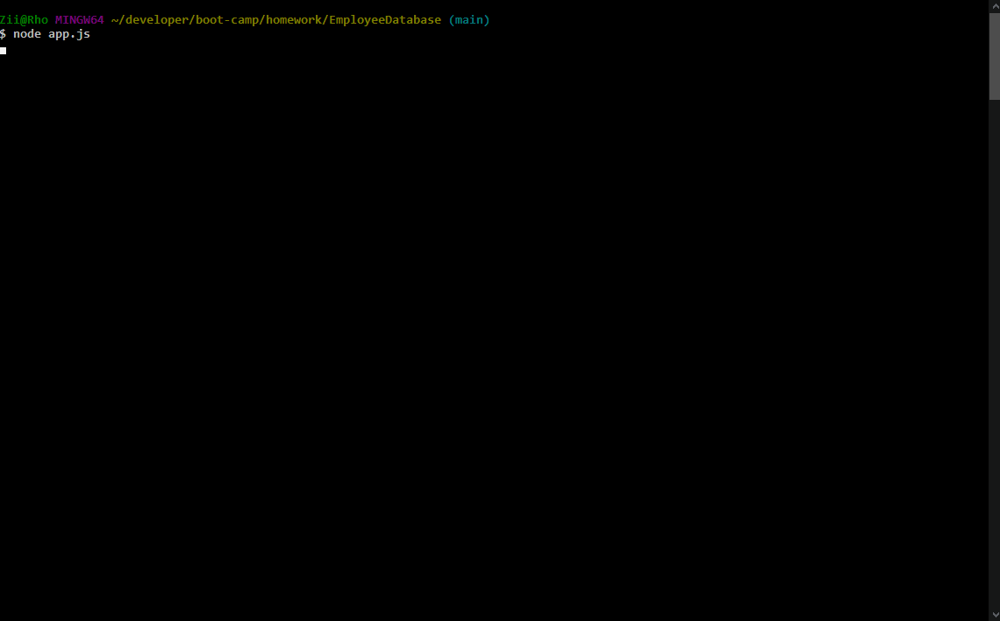

# EmployeeDatabase

[](https://opensource.org/licenses/MIT)

## Table of Contents
* [Description](#Description)
  * [Further Possibilities](#Further-Possibilities)
  * [Built With](#built-with)
* [Installation](#Installation)
* [Usage](#Usage)
* [License](#License)
* [Contributing](#Contributing)
* [Questions](#Questions)

## Description
A command-line Node app to manage a SQL database of employees. The database itself is designed to hold the employee's name, role, department, salary, and manager. To keep this information straight, it is split into 3 tables which are cross-referenced by MySQL.



Users are able to add as many departments, roles, and employees as they might need. Each role tracks the department and salary that go with it, so multiple employees doing the same task won't need duplicated information in the database. 

Users can view the data with a number of different filters:
* All departments
  * The utilized budget (or total salaries) of a chosen department
* All Roles
  * Roles present in a chosen department
* All Employees
  * Employees assigned to a chosen department
  * Employees reporting to a chosen manager

The data can then be edited for all information except an employee's name.

Users can also delete any item in the database they no longer need. To prevent data loss, the program checks that no other pieces are dependant on it to prevent accidentally deleting too much information.

### Further Possibilities
I would like to add more handling options for things like deleting a department or role that have employees assigned to them. The program currently refuses the action with no additional help, which isn't a great user experience. I would rather give an option in the same flow to reassign affected employees (or delete them as well, if the user chooses).

The ability to edit an employee's name would be a nice usability addition, as well.

### Built With

* Node.js
    * [inquirer](https://www.npmjs.com/package/inquirer)
    * [mysql npm package](https://www.npmjs.com/package/uniqid)
    * [console-table-printer](https://www.npmjs.com/package/console-table-printer)
    * [dotenv](https://www.npmjs.com/package/dotenv)
* MySQL

## Installation
To install app dependencies, run this command in your terminal:
```
npm i
```

## Usage
Before using the program, the MySQL database must be established. Please use the included Emp_db_schema.sql file to create it.

Be sure to update your MySQL password and port in the code before use, or create a .env file to hold them. 

## License
This project uses the MIT license. For more details, visit [this link](https://choosealicense.com/licenses/mit/).

## Contributing
Create a fork and send a pull request, or send me an email!

## Questions
If you have questions to ask or issues to report, please visit the [GitHub repository](https://github.com/ziieng/EmployeeDatabase) for this project, [my GitHub profile](https://github.com/ziieng), or send me an email at cjengelhardt@gmail.com.